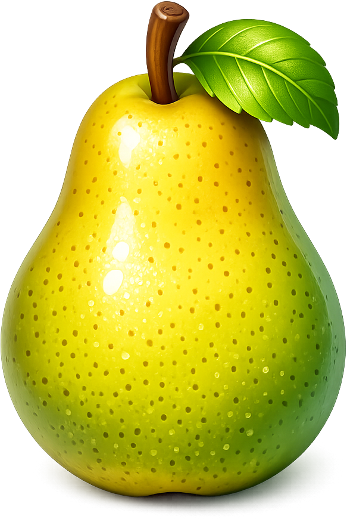
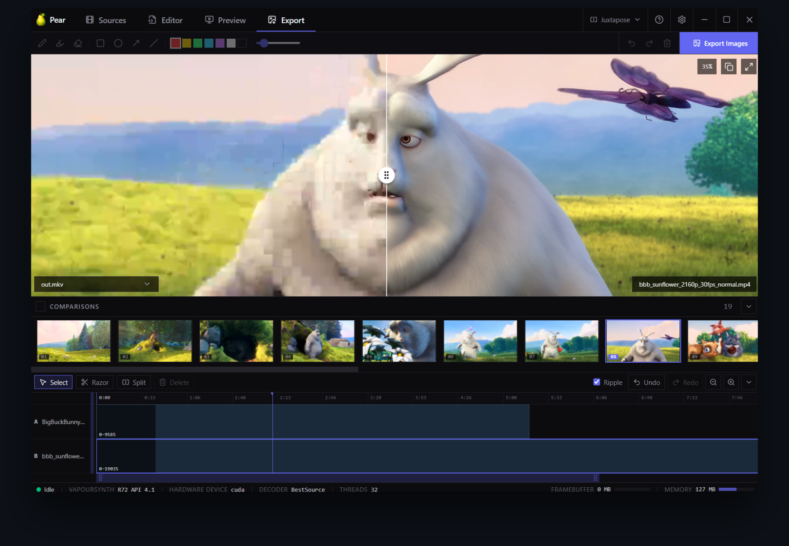

<p align="center">
   <a href="https://github.com/rlaphoenix/pear">Pear</a>
  <br/>
  <sup><em>The <b>PEAR</b>fect Compare Tool</em></sup>
</p>

<p align="center">
  <a href="https://github.com/rlaphoenix/pear/blob/master/LICENSE">
    
  </a>
  
  <a href="https://tauri.app">
    
  </a>
  <a href="http://www.vapoursynth.com">
    
  </a>
  <a href="https://github.com/rlaphoenix/pear/actions/workflows/ci.yml">
    
  </a>
</p>



Pear is a desktop app for building release-comparison screenshots across **any number of video
sources** - not just two. Load your sources, align them frame-accurately on a timeline, optionally
transform each one with a **VapourSynth** script, then export a set of matched frames in the
slow.pics batch layout.

## Features

- 🎞️ Compare any number of sources, side-by-side
- 🎯 Frame-accurate timeline alignment (per-source clips, trims, ripple edits)
- 🧬 Per-source VapourSynth scripting, with a full Python editor
- 🖥️ Hardware-accelerated decode via BestSource (CUDA / D3D11 / etc., or CPU)
- 🌈 HDR to SDR tonemapping (Dolby Vision, HDR10+, HLG) via libplacebo
- 🪡 Deinterlacing: BWDIF, NNEDI3, QTGMC, or Bob
- 📐 Per-source crop, aspect-ratio, colour matrix and range overrides
- 🔍 Live, scrubbable preview (juxtapose/split or source-cycle) with zoom and pan
- ✍️ Markup tools (pen, highlighter, shapes) burned into the exported images
- 📦 Fully self-contained - VapourSynth, Python and all plugins are bundled
- ❤️ Forever FOSS (GPL-3.0)

## Installation

To get set up and start using Pear right away, download the installer from the [Releases] page.
This Installer will setup all of the dependencies and configuration needed for you, and all of
the dependencies will be separated, isolated versions, and wont interfere with any pre-existing
installation of VapourSynth.

If you would rather install Pear, but use the pre-existing installation of VapourSynth, you can
by setting the `VSSCRIPT_PATH` environment variable to the `vsscript.dll` path of the installation
you wish to use. Alternatively, set it to an empty value and it will try and find an existing one
for you. Keep it unset (not even an empty value) to use the environment bundled with the installer.

For a portable installation, download the portable pear executable from the [Releases] page.
This executable is just the pear app, without any of the required dependencies that must be set
up. The following is a guide on what you need to install. If at any point further explanation is
required, I recommend asking an AI LLM like ChatGPT or Gemini, just link it this page and ask!

1. Install [VapourSynth] R55 or newer. Use the installer for a simple setup. If you wish to have
   VapourSynth live next to the portable exe, run the portable installer PS1 script (rename the
   resulting folder to `vapoursynth` and place it next to the pear executable).
2. Install Required Plugins. Install `vsrepo` with `pip install vsrepo`, then install the following
   with `vsrepo install`:

   - `bs` - BestSource, decodes every video and image source (the only strictly required one)
   - `placebo` - vs-placebo, HDR to SDR tonemapping (Dolby Vision, HDR10+, HLG)
   - `bwdif`, `nnedi3`, `znedi3`, `havsfunc` - the BWDIF, NNEDI3 and QTGMC deinterlacers
   - `misc`, `akarin`, `descale`, `vivtc`, `vsutil`, `mvtools`, `fmtconv`, `eedi3m`, `sangnom`, `dfttest`, `fft3dfilter`, `knlmeanscl`, `rgvs`, `addgrain`, `tcanny`, `ctmf`, `dctfilter` - commonly used general-purpose plugins

  [Releases]: <https://github.com/rlaphoenix/pear/releases>
  [VapourSynth]: <https://github.com/vapoursynth/vapoursynth/releases>

## Usage

### Welcome View

When you first launch Pear you will be greeted with the Welcome view. This is where you can
see brief instructions on using Pear, a list of your recent projects, and buttons to open either
some sources or a project file.

To get started, drag and drop or use the Add Sources button to load in some video files to compare.
Just about any codec and format is supported. If FFmpeg supports it, so does Pear, that includes
Dolby Vision, HDR10+, HDR10, and HLG.

Once you add at least one source, the Sources, Preview, and Export tabs will become usable.
Go over to the Sources tab.

### Sources

You can compare any amount of files, of any codec, format, resolution, frame rate, etc.
This sources tab allows you to manage the files you are comparing, including any initial setup.

Naming sources is recommended so that the export images can be named appropriately, especially
when uploading to sites like <https://slow.pics> or <https://comp.pics>.

Each source can be independently modified for comparison preparation to your liking, including
cropping, deinterlacing, tonemapping, modifying the aspect ratio, modifying the frame rate,
and setting the color matrix and color levels. Its up to you how you wish to compare, but its
generally recommended to try keep as much data when comparing, by comparing against the higher
quality file, compared to downscaling or reducing data.

There's a Spatial Alignment button in the top-right of the source tab bar that lets you control
spatial alignment of all loaded sources. For example, if you are comparing an SD file against a
HD file, you can choose to align all sources by upscaling the smallest sources to the largest,
downscaling the largest sources to the smallest, pad the smallest source to the largest, or crop
the largest source to smallest.

#### Editor

Beside each source's options, on the right of the Sources tab, is a full VapourSynth code editor
along with a template system. The source is already brought in behind the scenes as `clip` and
the path string is in as `SOURCE`. The `(?)` button on the editor header opens the VapourSynth
scripting guide.

Here you can make advanced edits like normalizing frame rate between sources, fixing color to
make a fair PQ comparison, advanced scaling like a zoom or pan rather than a naive crop/scale.
You have full control over this engine, so long as the output is a variable also named `clip`.

If you need to import/install a custom VapourSynth plugin or script, you can! If you open the
About menu (`(?)` button on the top right, next to settings) you will see a button called
"Open VapourSynth Folder". Assuming you used the installer to setup Pear, this will be the
isolated vendored copy of VapourSynth and it's Python installation.

With an isolated vendored installation, you can install plugins with `vsrepo` like this:

- Open the VapourSynth folder in PowerShell/Command Prompt.
- Run `.\python.exe vsrepo.py update`
- Run `.\python.exe vsrepo.py install <package_name>`

Alternatively, you can just place what you want into the `vs-plugins` or `vs-scripts` folders.

The template system allows you to save common edits for re-use in the future in the same or
other projects. Note however, that the templates you make and the template selected is not
saved in the project file, rather the script text is. The templates are available to be used
by any and all projects on your system. This is by design. A script that is only useful for
one specific project should not be made as a template.

If you dont need to make any edits in the VapourSynth engine, then make sure the code editor
for each source is empty or all comments. A bad script will cause all other parts of the
program to fail.

### Preview

This allows you to preview your Sources in various comparison modes. This should be used to
try and get the temporal sync aligned with all sources. It allows you to seek through your
video and make sure the frames line up.

You can zoom, pan, scrub, seek by frame, segment, or keyframe. You can copy the shown frame,
go fullscreen (in different ways).

The zoom % amount listed on the top right shows you the relative scale of the shown image.
100% means it is showing in the full native resolution. Clicking this cycles between native
and fit-to-window zoom modes.

You can also add this frame to the export tab, which you can read about below.

#### Comparison Modes

There's various modes to pick from, which can be changed with the dropdown on the top right of
the app, next to the `(?)` button.

- Single:    Shows one frame of one source at a time. Click to cycle through each source.
             Recommended to quickly compare two sources, pixel-peep, etc.
- Split:     Shows one frame of each source at the same time, in an equal amount of space.
             Recommended if you want to see either the full frame of each source at the same
             time, or zoom in to a specific part of the frame of all sources at the same time.
- Juxtapose: Shows parts of one frame of each source at the same time, with a swiper.
             Recommended if you like to slide a swiper horizontally across sources.
- Weave:     This is a special one, shows one frame of each source in a cycle.
             For example, with two sources, frame 1 will be Source A, frame 2 will be Source B.

#### Film-strip

The line of thumbnails under the preview is the film-strip. This is a resizable pane allowing
you to see a few previous and next frames of each source as you seek through. It is a very
quick way to see if sources are synced up.

You can show more or less frames by resizing it
either by making the app itself wider, or dragging the top border of the pane up/down. If you
dont like the film-strip pane, you can resize it all the way to nothing to hide it.

#### Control-bar

This is the controls to allow quick navigation of what the preview shows.

It contains the following components:

- Play/Pause: To enable playback of the project preview (note: its slow, film-strip will lag)
- Playhead: Lists the current project playback timestamp and frame number.
- Seekbar: Allows you to drag or click to seek across the project.
- Buttons: These let you seek back or forward by 1 frame, 1 segment, or 1 keyframe.

### Export

You likely wish to share a handful of comparison images to others, without them needing to have
the files themselves. Thats where this tab comes in play.

Like the Preview tab, you can use the same modes and systems to cycle between each source of
the comparison, and preview in different modes. Note however that the `Weave` mode does the same
as the `Single` mode in this tab.

One of the coolest features here is that you can apply markup to both frames of each comparison.
For example, add arrows to illustrate a part of the comparison that you wish to elaborate on, or
draw scribbles, or do whatever. The markup you apply will be on both frames in the exact same
position.

By default, it will try create up to 20 comparisons for you, randomly chosen, with margins to
make sure it skips a bit of the start and end of the file. It also tries to make sure that all
comparisons are a bit distanced from each other to avoid getting comparisons on the same scene.

You can hover over comparisons to check which ones you either want to delete, or re-randomize.
This is useful if you dont like a specific comparison, it shows nothing but logos, solid colors,
etc.

If you scroll all the way right on the list of comparisons, you will find a Add button if you
wish to add more comparisons. A reminder as well that the Preview tab has a button to add what
you are looking at as an exportable comparison (adding it to the end of the list).

The Export button will save all of the created comparisons, including any markup, as PNG images
wherever you would like. It saves them in a filename format that is supported by slow.pics batch
mode, allowing you to just select and drag all the files into slow.pics. It automatically names
the sources per-comparison to the names you set in the Sources tab for each source.

The Upload button allows you to upload the comparison images automatically to <https://slow.pics>
or <https://comp.pics>, giving you a shareable link. Optionally, saving it under your account, or
anonymously. Please see the documentation below on authenticating with your account.

### Timeline

Just like a NLE like Premiere Pro, or After Effects, each source becomes a track on the timeline
(tagged A, B, C, etc).

You can drag segments left to trim off frames from the start of the source. You can drag it right
to offset segments to line them up. You can use the Razor tool to split up segments to move or
re-order them. The split tool allows you to split the selected segment at the playhead.

By default, Ripple mode is turned on. When enabled, deleting a segment moves all segments to it's
right left, to where the deleted clip started. This makes the Razor tool (or Split tool) and the
Delete button a very convenient combo.

A typical flow is to seek around in the preview or timeline, and Split (or Razor) where a desync
or difference is, then Delete that segment if the frames arent wanted (solid colors, unique frames,
etc). However, theres many other ways to sync up frames. You can select a segment and use the 
arrow keys to nudge them by 1 frame at a time left or right, you can drag the segments left/right,
razor whenever you want, split whenever you want, re-order segments (maybe the intro is at two
different points between sources), etc.

You can re-order tracks by re-ordering the Sources in the Sources tab. There is no concept of
extra/empty tracks to hold segments. To re-order segments, just make a big enough empty space
and drag the segment into it.

Note: When a segment is selected on the Timeline, it takes priority for the arrow keys left/right
hotkeys, preventing you from moving 1 frame left/right in the preview pane. Simply click the
segment again so its not highlighted/focused, and you can use the arrow keys to move the preview
left and right by 1 frame again.

### Indexing

When adding a source to the app, either by drag-and-drop or clicking the Add Source buttons, an
indexing process will begin that may take a while. The speed depends on your hardware, the video
codec, bitrate, and filesize.

Index files are saved to `%LOCALAPPDATA%\pear\bsindex`, instead of the default directory set by
BestSource. This is because BestSource does a very basic filename structure that is not gated
by device used to generate it, and renaming or moving the file causes the index to be regenerated.
Pear however, sets a basic partial hash and the hardware device into each index filename, allowing
better re-use across renames, path changes, and most importantly, hardware device changes.

Indexes are specific to your machine and hardware. Do not share or use others index files. These
indexes are decoded specifically by your hardware, and likely differ. Even if you use the exact
same hardware, driver, software, or OS differences may cause the index to be different.

### Projects and Settings

All app settings are stored at `%APPDATA%\com.rlaphoenix.pear\prefs.json`.

All project settings are stored in the project file, including the project's cached thumbnail.
Project files are 'custom' zip-based `.pcp` files that contain a `settings.json` file and the
lossy `thumbnail.jpg`.

Projects are intended to be shared so others can re-use your editing/syncing efforts to also
compare the same files. However, it may also come in handy to re-use the same edits across
multiple files that share the same exact editing/syncing efforts. Simply unzip the file,
edit the `settings.json` to reference the other files, re-zip, and load.

When loading project files, a partial hash is compared against the files to ensure they are
the same file. You will be prompted if the hashes do not match, but you can skip this.

### Keyboard Shortcuts

A list of available shortcuts are available in the About menu.
If you think a convenient shortcut is missing, suggest it.

## Authenticating with slow.pics

Slow.pics is a free, closed-source, image file host and comparer, with open registration.
Authentication is handled by manually preparing a cookie and saving it to your Pear settings.

1. Important: Open a *NEW* incognito/private window and log in to <https://slow.pics>.
2. Open DevTools by pressing F12, click the `Application/Storage` tab, look for Cookies, select
   `https://slow.pics`, and copy the full value of the `remember-me` cookie.
3. Make some comparisons, click the Upload button, and select `slow.pics` as the provider.
4. Paste the `remember-me` Cookie value into the Cookie field at the bottom of the form.
5. Important: Close the incognito window without logging out, to keep the cookie alive.

It is very important you do these steps on a NEW incognito/private window and do a fresh login.
If you use the cookie of your existing login, then updates to the cookie value on your browser
will interfere/break the cookie used by the Pear app, and vice-versa. Make sure you do NOT logout
of the incognito window, or the cookie value you pasted into Pear will quickly become invalid.

## Authenticating with comp.pics

Comp.pics is a free, open-source, image file host and comparer, but registration is invite-only.
Authentication is handled with an API Key generated on the website, saved to your Pear settings.
The source code is available here: <https://github.com/thezak48/comps> (GPL-3.0).

1. Login at <https://comp.pics/login>
2. Head to your account page at <https://comp.pics/account>
3. Scroll down to the API Keys section, write "Pear" into the input field, and click "Generate New Key".
4. Make some comparisons, click the Upload button, and select `comp.pics` as the provider.
5. Paste the API Key into the API Key field at the bottom of the form.

The API Key will be saved and re-used in future uploads.

## Building

Install [Node.js] 18+, [Rust] (with the [Tauri prerequisites]), then:

```shell
git clone https://github.com/rlaphoenix/pear
cd pear
npm install
npm run dev
```

To build the installer you first need to create a .env file with appropriate values. See the
`.env.example` file, copy it, name it `.env`, and edit it's values. Then run `npm run build`.

When running `npm run dev` or `npm run build`, it first runs `npm run vendor`, which assembles
the isolated VapourSynth + Python + plugins bundle into `app/vendor/` (a one-time download).

You can skip this by just emptying this file, but if you do, make sure you have VapourSynth
installed and with all required dependencies (incl. the VapourSynth plugins and scripts).

The frontend code (React+Vite) is available in `/ui`.  
The backend code (Rust+Tauri) is available in `/app`.

  [Node.js]: <https://nodejs.org>
  [Rust]: <https://rustup.rs>
  [Tauri prerequisites]: <https://tauri.app/start/prerequisites/>

## License

Pear is licensed under the [GNU General Public License v3.0](LICENSE). You are free to use, study,
share, and modify it, but if you distribute it you must make your complete corresponding source
(including any changes) available under the same license.

The third-party software Pear bundles or links is used unmodified; a copy of each of their licenses
ships in the installer's `licenses/` folder (and the bundled VapourSynth runtime carries its
embedded Python and per-plugin licenses).

* * *

© rlaphoenix 2026
